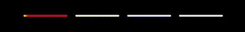

# MMM-page-indicator

**MMM-page-indicator** is a [MagicMirror²][mm] module that indicates which page is currently visible. It serves as an indicator and provides an easy way to switch pages by clicking on the circle representing the page you want to navigate to.

This module works well with [MMM-pages], but it is compatible with any module that sends the `PAGE_CHANGED` notification.

## Screenshot


## Project Status

This module is in **maintenance mode**. It is a small but mature and does what it is supposed to do.

We will be keeping this module compatible with the latest version of MagicMirror², but we don't plan to add any new features or make any major changes to the codebase.

If you have any issues or bugs, please feel free to open an issue.

## Installation

In your terminal, go to your MagicMirror's module directory and clone this repository:

```bash
cd ~/MagicMirror/modules
git clone https://github.com/edward-shen/MMM-page-indicator
```

### Update

Just enter the module's directory, pull the update and install the dependencies:

```bash
cd ~/MagicMirror/modules/MMM-page-indicator
git pull
```

## Configuration

To use this module, add it to the modules array in the `config/config.js` file:

```js
    {
        module: 'MMM-page-indicator',
        position: 'bottom_bar',
        config: {
            activeBright: true,
        }
    },
```

### Configuration options

All configuration options are optional.

| Option                  | Description                                                                                           |
| ----------------------- | ----------------------------------------------------------------------------------------------------- |
| `pages`                 | Number of pages that you have.<br/>**Value type:** `int`<br/>**Default value:** `3`                   |
| `activeBright`          | Should the active circle be bright.<br/>**Value type:** `boolean`<br/>**Default value:** `false`      |
| `inactiveDimmed`        | Should the inactive circles be dimmed?<br/>**Value type:** `boolean`<br/>**Default value:** `true`    |
| `inactiveHollow`        | Should the inactive circles be hollow?<br/>**Value type:** `boolean`<br/>**Default value:** `true`    |
| `showPageNumberOnHover` | Should the page number be shown on hover?<br/>**Value type:** `boolean`<br/>**Default value:** `true` |

## Styling

With the CSS classes `active-page` and `page-{i}` you can easily style the page indicators. The `active-page` class is applied to the currently active page indicator, while the `page-{i}` class is applied to the page indicator of page number `i`. This allows you to change the color, icon and other properties of the indicators.

Without styling, the indicators will look like this:


Below are some styling examples. Just add them to your `custom.css` file (usually located in `~/MagicMirror/css/`) to test them on your system. With CSS you can do a lot of things, so feel free to experiment with the styles.

### Example: Changing the icon of a page indicator

You can assign a different icon per page indicator. This example sets the page 2 indicator to a orange star.


<details>
<summary>Click to see the CSS</summary>

```css
.MMM-page-indicator .page-2::before {
  color: orange;
  content: "⭐";
}
```

</details>

### Example: Animating the active page indicator

This example extends the one above and adds a pulsing effect to the active page indicator.


<details>
<summary>Click to see the CSS</summary>

```css
.MMM-page-indicator .page-2::before {
  color: orange;
  content: "⭐";
}

@keyframes pulse {
  0%,
  100% {
    transform: scale(1);
    opacity: 1;
  }
  50% {
    transform: scale(1.3);
    opacity: 0.6;
  }
}

.MMM-page-indicator .active-page {
  animation: pulse 1.2s ease-in-out infinite;
}
```

</details>

### Example: Adding description text to the page indicators

This is an advanced example which adds a description text to the page indicators and changes every indicator to a different icon.


<details>
<summary>Click to see the CSS</summary>

```css
.MMM-page-indicator .indicator::before {
  font-size: 1.5rem;
  font-weight: 600;
  font-variant-emoji: text;
  line-height: 1.6;
  letter-spacing: 0.2rem;
  white-space: pre;
  padding: 0px 15px;
}

.MMM-page-indicator .page-0::before {
  content: "🏠 \A Home";
}

.MMM-page-indicator .page-1::before {
  content: "📅 \A Calendar";
}

.MMM-page-indicator .page-2::before {
  content: "⭐ \A News";
}

.MMM-page-indicator .page-3::before {
  content: "⛅ \A Weather";
}

@keyframes pulse {
  0%,
  100% {
    transform: scale(1);
    opacity: 1;
  }
  50% {
    transform: scale(1.3);
    opacity: 0.6;
  }
}

.MMM-page-indicator .active-page {
  color: orange;
  font-variant-emoji: text;
  animation: pulse 5s ease-in-out infinite;
}
```

</details>

### Example: Rectangular progress-style indicators

Turn the dots into elongated bars with a sweeping highlight similar to carousel indicators. The active bar turns red and shows a yellow streak sliding across it.



<details>
<summary>Click to see the CSS</summary>

```css
.MMM-page-indicator {
  --indicator-width: 80px;
  --indicator-height: 4px;
  --indicator-streak-width: 8px;
  --indicator-gap: 8px;
  --indicator-color: #e1e2e4;
  --indicator-active-color: #e40000;
  --indicator-streak-color: yellow;
  --indicator-streak-blur: 2px;
  --indicator-sweep-duration: 5s;
}

.MMM-page-indicator .circle-wrapper {
  margin: 0 var(--indicator-gap);
}

.MMM-page-indicator .indicator {
  display: inline-block;
  width: var(--indicator-width);
  height: var(--indicator-height);
  border-radius: 2px;
  background: var(--indicator-color);
  position: relative;
  overflow: hidden;
  color: transparent;
}

.MMM-page-indicator .indicator::before {
  content: "";
}

.MMM-page-indicator .active-page {
  background: var(--indicator-active-color);
}

.MMM-page-indicator .active-page::after {
  content: "";
  position: absolute;
  top: -150%;
  bottom: -150%;
  left: calc(var(--indicator-streak-width) * -2);
  width: var(--indicator-streak-width);
  background: var(--indicator-streak-color);
  filter: blur(var(--indicator-streak-blur));
  opacity: 0.9;
  animation: indicator-sweep var(--indicator-sweep-duration) linear infinite;
  pointer-events: none;
}

@keyframes indicator-sweep {
  0% {
    transform: translateX(0);
  }

  100% {
    transform: translateX(
      calc(var(--indicator-width) + (var(--indicator-streak-width) * 2))
    );
  }
}
```

</details>

## Sending notifications to the module

This module responds to the notification `PAGE_CHANGED`. The payload should be an `integer`. Note that this has strict error checking, so `"3"` will not work, while `3` will. Also do note that to switch to page 1, you need to send `0` to the module. **This uses a zero-based numbering system.**

Let's say that you want to change the indicator to page 3. In your code, you would write:

```js
this.sendNotification("PAGE_CHANGED", 2);
```

This would cause the module to change show that you are on page 3.

If you wish to change the number of pages, you need to send a `MAX_PAGES_CHANGED` notification with your payload as an integer.

```js
this.sendNotification("MAX_PAGES_CHANGED", 4);
```

This would now show that there are now 4 pages to display.

You can also just send `PAGE_INCREMENT` or `PAGE_DECREMENT` without any payloads to have the module change the displayed page by one. If you are using [MMM-pages] with this module, sending an integer as a payload for a `PAGE_INCREMENT` or `PAGE_DECREMENT` notification will perform as described in [the MMM-pages documentation](https://github.com/edward-shen/MMM-pages#notifications). If you are not using MMM-pages, the indicator will ignore the payload and just change the displayed page by one.

## FAQ

- Help! My module is (above/below) another module in the same region but I want it to be somewhere else!

  The order of your `config.js` determines your module location. If you have two modules, both with `position:bottom_bar`, the one that is first listed will appear on top. The rest will appear in the same order you defined them in. If you want this module to be at the very bottom, define this module as the last module in your `config.js` file. If you want it to be on top in that region, make sure no other module is defined before it that has the same region.

- Can I make a pull request?

  Please do! I'd love for this to be integrated in many modules!

- I want more config options!

  Please make an issue. Thanks!

## Developer commands

- `npm install` - Install dependencies for development.
- `node --run demo` - Start MagicMirror with demo config showcasing and testing the module.
- `node --run lint` - Run linting checks.
- `node --run lint:fix` - Fix linting issues.
- `node --run release` - Create a new release. (Bumps version, creates changelog, commits, tags)

## License

This project is licensed under the MIT License - see the [LICENSE](LICENSE.md) file for details.

## Changelog

All notable changes to this project will be documented in the [CHANGELOG](CHANGELOG.md) file.

[mm]: https://github.com/MagicMirrorOrg/MagicMirror
[MMM-pages]: https://github.com/edward-shen/MMM-pages
