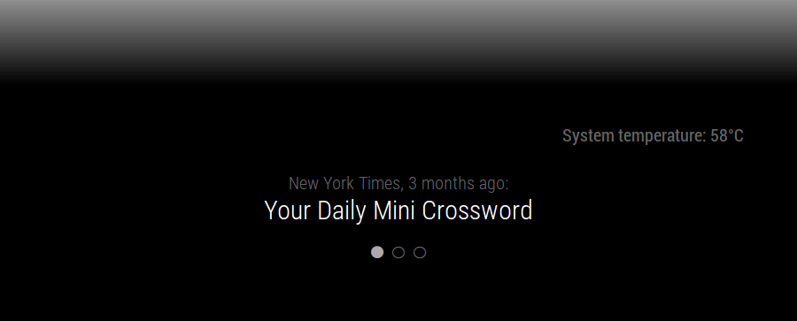

## Maintainer needed

Hello, it's been 5 years since I've written this! While I'm happy to see it
thriving, it's also about time I step away. I haven't had a magic mirror up
in years, and to be frank, I'm hoping someone else will be willing to take
up maintainership of the project.

That being said, this is a very mature project in that it does not need
frequent updates. It does what it needs to do, and there's really no need for
it to have new features. I would still recommend using it today, if not because
people rarely seem to have problems with it.

It's a very small project (with the intent to keep it this way), so if you're
interested, please don't hesitate to reach out.

---

# MMM-page-indicator




This [MagicMirror²][mm] Module is designed to indicate what "page" you are looking at. This module is designed to be an indicator only. By itself, it only offers a basic way to change the page, by clicking on the circle indicative of the page you wish to change to.

## Installation

In your terminal, go to your MagicMirror's Module folder:

```bash
cd ~/MagicMirror/modules
```
Clone this repository:
```bash
git clone https://github.com/edward-shen/MMM-page-indicator.git
```
Configure the module in your config.js file.

## Sending notifications to the module

This module responds to the notification `PAGE_CHANGED`. The payload should be an `integer`. Note that this has strict error checking, so `"3"` will not work, while `3` will. Also do note that to switch to page 1, you need to send `0` to the module. **This uses a zero-based numbering system.**

Let's say that you want to change the indicator to page 3. In your code, you would write:
```js
this.sendNotification("PAGE_CHANGED", 2);
```
This would cause the module to change show that you are on page 3.

If you wish to change the number of pages, you need to send a `MAX_PAGES_CHANGED` notification with your payload as an integer.

```js
this.sendNotification("MAX_PAGES_CHANGED", 4);
```

This would now show that there are now 4 pages to display.

You can also just send `PAGE_INCREMENT` or `PAGE_DECREMENT` without any payloads to have the module change the displayed page by one. If you are using [MMM-pages](https://github.com/edward-shen/MMM-pages.git) with this module, sending an integer as a payload for a `PAGE_INCREMENT` or `PAGE_DECREMENT` notification will perform as described in [the MMM-pages documentation](https://github.com/edward-shen/MMM-pages#notifications). If you are not using MMM-pages, the indicator will ignore the payload and just change the displayed page by one.

## Using the module

To use this module, add it to the modules array in the `config/config.js` file:
```js
modules: [
    {
        module: 'MMM-page-indicator',
        position: 'bottom_bar',
        config: {
            pages: 3,
        }
    }
]
```

## Configuration options

Option|Description
------|-----------
`pages`|Number of pages that you have.<br/>**Expected Value type:** `int`.
`activeBright`|Should the active circle be bright.<br/>**Expected Value type:** `boolean`.
`inactiveDimmed`|Should the inactive circles be dimmed?<br/>**Expected Value type:** `boolean`.
`inactiveHollow`|Should the inactive circles be hollow?<br/>**Expected Value type:** `boolean`.

## Styling

- With the newly added classes, `active-page` and `page-${i}` styling of the indicator is now easier.
- Below are some styling examples

In the below example you can assign a different icon/indicator per page indicator. Below example sets the page 3 indicator to a star.

```css
.MMM-page-indicator .fa.indicator.page-2::before {
    content:"\f005";
    color: orange;
    animation: blink 1s infinite;
}
```
In the below example you can set animation effects to the current active-page's indicator.

```css
.MMM-page-indicator .indicator.active-page {
    animation: pulse 1.2s ease-in-out infinite;
}
```

## FAQ

- Help! My module is (above/below) another module in the same region but I want it to be somewhere else!

  The order of your `config.js` determines your module location. If you have two modules, both with `position:bottom_bar`, the one that is first listed will appear on top. The rest will appear in the same order you defined them in. If you want this module to be at the very bottom, define this module as the last module in your `config.js` file. If you want it to be on top in that region, make sure no other module is defined before it that has the same region.
  
- Can I make a pull request?

  Please do! I'd love for this to be integrated in many modules!
  
- I want more config options!

  Please make an issue. Thanks!

[mm]: https://github.com/MichMich/MagicMirror
